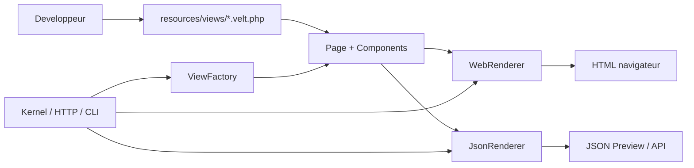

# Architecture detaillee de Velt UI

Ce document sert de carte centrale pour comprendre le module `velt-ui` dans ton projet.

Il explique :

- le role de chaque dossier utile ;
- le role de chaque fichier principal ;
- la logique ligne par ligne, mais au niveau des blocs de code et des responsabilites ;
- la maniere dont les donnees circulent entre Kernel, HTTP, Preview, CLI et UI ;
- la facon dont une meme source de donnees produit du HTML, du JSON et des usages reutilisables.

Important : ce document couvre le code source du module et les fichiers de support du projet. Le dossier `vendor/` contient des dependances installees par Composer et n'est pas documente ligne par ligne ici.

## Idee generale

`velt-ui` ne dessine pas l'interface avec du HTML brut ecrit partout.

Le module construit plutot un arbre d'objets PHP :

- `Page` represente un ecran complet ;
- `Component` represente un noeud UI ;
- les composants concrets (`Card`, `Button`, `Form`, `Input`, `Link`, `Text`, `Alert`) specialisent cette base ;
- `ViewFactory` charge une vue declarative depuis un fichier `.velt.php` ;
- `WebRenderer` convertit cet arbre en HTML ;
- `JsonRenderer` convertit le meme arbre en JSON stable pour Preview ou d'autres clients.

Le point central est simple : une seule source de verite, plusieurs sorties.

## Role de chaque dossier

### `src/`

Le dossier `src/` contient le coeur du module.

Il regroupe :

- la page racine ;
- les composants UI ;
- les contrats publics ;
- les renderers ;
- les utilitaires partages ;
- la fabrique de vues.

### `src/Components/`

Ce dossier porte les briques UI declaratives.

Chaque classe a le meme role architectural : stocker une intention UI, pas une logique metier.

- `Component.php` : classe de base commune ;
- `Alert.php` : message visible a l'utilisateur ;
- `Button.php` : action ;
- `Card.php` : bloc ou conteneur visuel ;
- `Form.php` : formulaire declaratif ;
- `Input.php` : champ de saisie ;
- `Link.php` : lien ;
- `Text.php` : contenu textuel ou titre.

### `src/Contracts/`

Ce dossier definit les contrats publics.

Il sert a casser les dependances directes entre les classes concretes et les couches qui les consomment.

- `ComponentInterface.php` : contrat commun des composants ;
- `RendererInterface.php` : contrat des strategies de rendu ;
- `ViewInterface.php` : contrat d'une vue chargeable.

### `src/Renderers/`

Ce dossier transforme les objets UI en donnees consommables.

- `WebRenderer.php` : produit du HTML ;
- `JsonRenderer.php` : produit du JSON preview.

### `src/Support/`

`Html.php` regroupe les helpers d'echappement et de construction des attributs HTML.

Le but est d'eviter de dupliquer des operations sensibles dans plusieurs renderers.

### `src/View/`

Ce dossier contient le mecanisme de chargement des vues.

- `ViewFactory.php` : resolut le nom logique d'une vue et retourne une `Page` ;
- `ViewNotFoundException.php` : signale proprement qu'une vue n'existe pas ou retourne une mauvaise valeur.

### `resources/views/`

Ce dossier contient les vues declaratives du projet.

Chaque fichier `.velt.php` retourne une `Page` construite avec les composants du module.

Exemple : `resources/views/auth/login.velt.php`.

### `public/`

Ce dossier contient le point d'entree web minimal.

Le fichier `public/index.php` montre comment charger une page et la rendre en HTML.

### `tests/`

Ce dossier contient les verifications du comportement.

Les tests valident :

- le chargement des vues ;
- la conversion en HTML ;
- la conversion en JSON ;
- les contrats publics ;
- la structure des composants et de la page.

### `docs/`

Ce dossier contient la documentation du module.

- `README.md` : point d'entree de la documentation ;
- `ARCHITECTURE_DEVELOPPEUR.md` : vue d'ensemble de l'architecture ;
- `ARCHITECTURE_DETAILLEE.md` : ce document ;
- `EXPLICATION_CODE_OO.md` : lecture OO plus proche du code ;
- `CONCRETEMENT.md` : explication pratique d'utilisation ;
- `KERNEL_INTEGRATION.md` : integration avec le kernel ;
- `KERNEL_CONNECTION_DONE.md` : etat de la connexion locale ;
- `ISSUE_KERNEL_UI_CONNECTION.md` : note de travail cote kernel.

### `vendor/`

Ce dossier contient les dependances installees par Composer.

Il n'est pas la source metier du module, donc il ne fait pas partie de la lecture fonctionnelle du projet.

## Role de chaque fichier principal

### `composer.json`

Ce fichier declare le package PHP, l'autoload PSR-4, les scripts et les contraintes de developpement.

Dans ce module, son role est surtout de relier `Velt\\Ui\\` au dossier `src/`.

### `src/Page.php`

`Page` est la racine d'une interface.

Role precise :

- stocker le titre de l'ecran ;
- stocker un layout logique ;
- stocker les metas ;
- stocker les composants enfants ;
- fournir `toArray()` pour la serialisation ;
- fournir `toJson()` pour le rendu JSON direct.

Chaque ligne du fichier sert a garder la page comme objet simple, chainable et serialisable.

### `src/Components/Component.php`

`Component` est la base commune de tous les composants.

Role precise :

- stocker le type interne ;
- stocker les props ;
- stocker les enfants ;
- stocker un contenu textuel optionnel ;
- offrir des methodes communes comme `class()`, `showIf()`, `add()` et `toArray()`.

Le fichier evite la duplication de logique entre les composants specialises.

### `src/Components/Card.php`

`Card` represente un bloc visuel generique.

Il herite de `Component` sans ajouter de comportement complexe.

### `src/Components/Button.php`

`Button` represente une action utilisateur.

Il conserve :

- le label ;
- le type HTML ;
- la variante logique ;
- l'etat desactive.

### `src/Components/Alert.php`

`Alert` represente un message de statut ou d'erreur.

Il garde le texte et le type logique de l'alerte.

### `src/Components/Form.php`

`Form` represente un formulaire declaratif.

Il garde :

- la methode HTTP ;
- l'action ;
- l'intention CSRF.

### `src/Components/Input.php`

`Input` represente un champ de saisie.

Il garde :

- le nom logique du champ ;
- son label ;
- son type ;
- son caractere obligatoire ;
- son placeholder ;
- sa valeur initiale.

### `src/Components/Link.php`

`Link` represente une navigation declarative.

Il garde le texte du lien et son href.

### `src/Components/Text.php`

`Text` represente un contenu textuel simple ou un titre.

Il garde le texte et le tag logique souhaite pour le rendu HTML.

### `src/Contracts/ComponentInterface.php`

Ce contrat dit ce qu'un composant doit savoir exposer.

Il rend possible un traitement commun sans connaitre la classe concrete.

### `src/Contracts/RendererInterface.php`

Ce contrat dit qu'un renderer recoit une `Page` et retourne une chaine.

Il permet de brancher plusieurs strategies de sortie.

### `src/Contracts/ViewInterface.php`

Ce contrat decrit une vue chargeable.

`Page` l'implemente pour que la factory et les renderers sachent quoi attendre.

### `src/Renderers/WebRenderer.php`

Ce fichier porte la transformation Page -> HTML.

Role precise :

- lire les metadonnees de la page ;
- construire le document HTML ;
- rendre chaque composant ;
- echapper les contenus ;
- injecter le CSRF si un resolver est fourni par la couche HTTP.

### `src/Renderers/JsonRenderer.php`

Ce fichier porte la transformation Page -> JSON Preview.

Role precise :

- construire un schema versionne ;
- decrire les composants comme donnees ;
- conserver les props utiles ;
- fournir une structure stable aux clients Preview ou API.

### `src/Support/Html.php`

Ce helper centralise la securite HTML.

Il evite de dupliquer `htmlspecialchars` et la construction des attributs dans plusieurs classes.

### `src/View/ViewFactory.php`

Cette fabrique charge les vues declaratives depuis le systeme de fichiers.

Role precise :

- convertir un nom logique comme `auth.login` en chemin fichier ;
- valider le nom ;
- charger le fichier ;
- verifier qu'il retourne une `Page`.

### `src/View/ViewNotFoundException.php`

Cette exception donne un message explicite si la vue est absente ou invalide.

### `resources/views/auth/login.velt.php`

Cette vue est un exemple concret.

Elle montre comment une page peut etre declaree avec `Page`, `Card`, `Form`, `Input`, `Button`, `Link` et `Text`.

### `public/index.php`

Ce fichier montre le point d'entree web minimal.

Il charge l'autoload, instancie `ViewFactory`, recupere la vue, cree `WebRenderer`, puis affiche la sortie HTML.

### `tests/*.php`

Les tests verifient le contrat fonctionnel du module.

Ils servent de garde-fou pour la structure de l'arbre UI, le rendu HTML, le rendu JSON et le chargement des vues.

## Lecture ligne par ligne : comment comprendre le code

Le niveau de detail ligne par ligne est deja documente dans `EXPLICATION_CODE_OO.md`.

Ici, la logique a retenir est la suivante : chaque fichier source se compose de blocs repetitifs et lisibles :

- declaration du namespace ;
- import des dependances ;
- declaration de la classe ;
- proprietes ;
- constructeur ;
- methodes de creation ;
- methodes de transformation ;
- methodes d'acces ;
- conversion en tableau ou en string.

Autrement dit, chaque ligne sert soit a stocker une intention, soit a la transformer, soit a la transmettre a une couche superieure.

## Lecture du schema d'architecture

La communication entre les blocs de ton dessin suit cette logique :

### 1. Developpeur -> vues declaratives

Le developpeur ecrit un fichier `.velt.php` dans `resources/views/`.

Ce fichier ne doit pas produire du HTML direct complexe. Il doit decrire une page.

### 2. Kernel -> ViewFactory

Le kernel choisit quelle vue charger.

Il appelle `ViewFactory`, qui transforme un nom logique en fichier PHP et retourne une `Page`.

### 3. Page -> renderers

La `Page` est alors une structure intermediaire commune.

Elle peut partir vers :

- `WebRenderer` pour le navigateur ;
- `JsonRenderer` pour Preview, API ou debug ;
- `toArray()` pour les tests ou la serialization interne.

### 4. WebRenderer -> HTML

Le renderer web transforme l'arbre UI en HTML propre, echappe et stable.

Ce HTML sert a la reponse HTTP ou a un fragment reexploitable.

### 5. JsonRenderer -> JSON

Le renderer JSON transforme la meme page en donnees structurées.

Ces donnees servent a la Preview, a un client distant, a un diff ou a un stockage d'aperu.

### 6. Reemploi des donnees

Les memes informations peuvent etre reutilisees :

- par le navigateur via HTML ;
- par l'application Preview via JSON ;
- par le kernel pour une reponse HTTP ;
- par les tests pour verifier la structure ;
- par le CLI pour generer ou valider une vue.

Le principe est que la source reste la page declarative, pas le format final.

## Dependances dans tous les sens

Il faut lire la dependance comme une direction de responsabilite, pas comme un couplage fort partout.

### Dependances descendantes

- `velt-ui` depend du kernel minimal pour fournir son ServiceProvider ;
- le module HTTP depend du renderer choisi pour produire la sortie ;
- la Preview depend du JSON produit par `JsonRenderer`.

### Dependances internes du module

- `Page` depend des contrats et des composants ;
- `Component` depend de `ComponentInterface` ;
- `WebRenderer` et `JsonRenderer` depend de `Page` et des contrats publics ;
- `ViewFactory` depend de `Page` et du systeme de fichiers ;
- `Html` est un utilitaire partage par les renderers.

### Ce que le module ne fait pas

- il ne gere pas les routes ;
- il ne gere pas la session ;
- il ne gere pas la base de donnees ;
- il ne gere pas la persistence des vues ;
- il ne genere pas les vrais tokens CSRF tout seul ;
- il ne decide pas du style final de l'application.

## Generation et reutilisation des donnees

Une seule definition UI peut alimenter plusieurs usages.

### Source

La source est le fichier `.velt.php` qui retourne une `Page`.

### Transformation

La page peut ensuite etre convertie de trois facons utiles :

- en HTML via `WebRenderer` ;
- en JSON via `JsonRenderer` ;
- en tableau via `toArray()` pour debug, tests ou serialisation interne.

### Reutilisation

Le HTML est reutilise pour l'affichage navigateur.

Le JSON est reutilise pour Preview, outils d'inspection ou clients externes.

Le tableau PHP est reutilise pour les tests et pour verifier que la structure n'a pas change.

Le gain principal est la coherence : un seul arbre UI, plusieurs sorties, moins de duplication.

## Ce qu'il faut lire en premier

Si tu veux comprendre le module dans l'ordre le plus efficace :

1. `src/Page.php`
2. `src/Components/Component.php`
3. `src/Components/Text.php`
4. `src/Renderers/WebRenderer.php`
5. `src/Renderers/JsonRenderer.php`
6. `src/View/ViewFactory.php`
7. `resources/views/auth/login.velt.php`
8. `public/index.php`

Cet ordre te donne le chemin complet : donnee -> arbre -> rendu -> usage.
