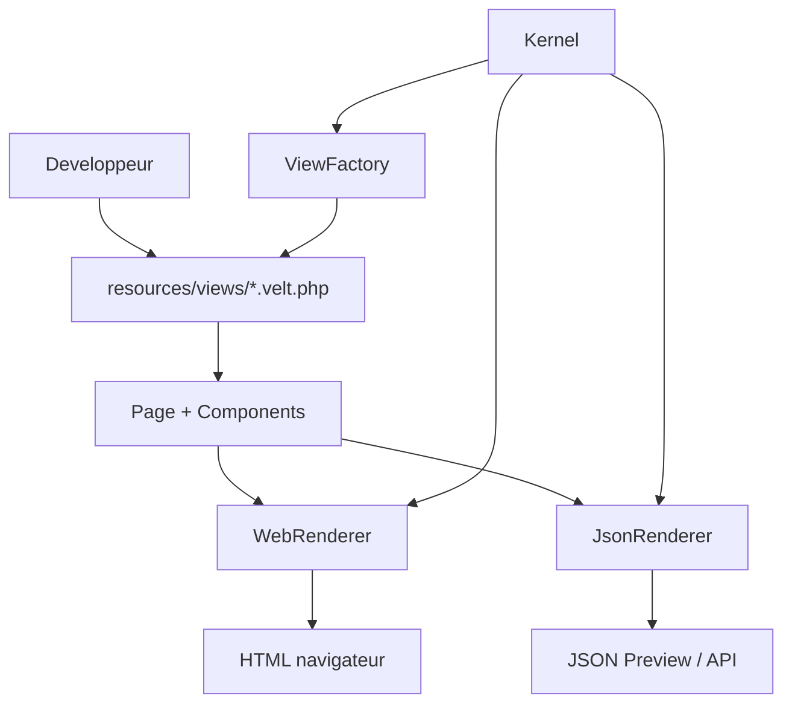

# Rapport de memoire de defense - Velt UI

Ce document est redige comme une base de rapport pour une soutenance ou une memoire technique.

Son but est de montrer clairement :

- a quoi sert le module `velt-ui` dans l'architecture globale ;
- le role de chaque dossier et des fichiers principaux ;
- comment lire le code ligne par ligne sans perdre le fil de l'ensemble ;
- comment les donnees sont produites, transformees et reutilisees en HTML, JSON et autres sorties ;
- comment les dependances circulent entre le kernel, l'HTTP, la Preview et le module UI.

Pour la lecture ligne par ligne exhaustive du code objet, voir [EXPLICATION_CODE_OO.md](EXPLICATION_CODE_OO.md).
Pour la carte technique des dossiers et fichiers, voir [ARCHITECTURE_DETAILLEE.md](ARCHITECTURE_DETAILLEE.md).

## 1. Position du module dans l'architecture

`velt-ui` est le module qui decrit l'interface utilisateur de Velt en PHP declaratif.

Il n'est pas charge du routage, ni de la persistence, ni des reponses HTTP completes. Il construit une representation intermediaire de l'UI, puis la transforme selon le besoin en :

- HTML pour le navigateur ;
- JSON pour Preview ou un consommateur externe ;
- tableau PHP pour les tests et la serialisation interne.

L'idee centrale est de separer la definition de l'interface de sa forme finale.



## 2. Rôle de chaque dossier

### `src/`

Le dossier `src/` contient la logique metier du module.

Il regroupe tous les elements qui definissent, chargent, transforment et serialisent l'UI.

### `src/Components/`

Ce dossier contient les classes qui representent les briques visuelles.

Chaque fichier correspond a une intention UI precise :

- `Component.php` : base commune de tous les composants ;
- `Alert.php` : message d'information ou d'erreur ;
- `Button.php` : action utilisateur ;
- `Card.php` : bloc de contenu ;
- `Form.php` : formulaire declaratif ;
- `Input.php` : champ de saisie ;
- `Link.php` : lien de navigation ;
- `Text.php` : texte simple ou titre.

### `src/Contracts/`

Ce dossier contient les contrats publics.

Il permet aux autres couches de dependre d'une interface stable plutot que d'une classe concrete.

- `ComponentInterface.php` : ce qu'un composant doit exposer ;
- `RendererInterface.php` : ce qu'un renderer doit faire ;
- `ViewInterface.php` : ce qu'une vue chargeable doit fournir.

### `src/Renderers/`

Ce dossier transforme la meme source de donnees en sorties differentes.

- `WebRenderer.php` : rend la page en HTML ;
- `JsonRenderer.php` : rend la page en JSON versionne.

### `src/Support/`

`Html.php` regroupe l'echappement et la generation d'attributs HTML.

Ce helper evite la duplication des operations de securite.

### `src/View/`

Ce dossier gere le chargement des vues declaratives.

- `ViewFactory.php` : resout un nom logique en fichier, le charge et retourne une `Page` ;
- `ViewNotFoundException.php` : signale qu'une vue est absente ou invalide.

### `resources/views/`

Ce dossier contient les pages Velt ecrites comme des fichiers PHP declaratifs.

Chaque fichier `.velt.php` retourne une `Page`.

Exemple : `resources/views/auth/login.velt.php`.

### `public/`

Ce dossier contient le point d'entree web minimal.

`public/index.php` montre comment charger une vue et l'afficher.

### `tests/`

Ce dossier contient les verifications du comportement.

Les tests assurent que :

- les vues se chargent correctement ;
- les composants gardent leur structure ;
- le rendu HTML est stable ;
- le rendu JSON est stable ;
- les contrats restent compatibles.

### `docs/`

Ce dossier regroupe la documentation technique et fonctionnelle.

- `README.md` : point d'entree de la documentation ;
- `ARCHITECTURE_DEVELOPPEUR.md` : vue d'ensemble du module ;
- `ARCHITECTURE_DETAILLEE.md` : carte detaillee des dossiers et fichiers ;
- `EXPLICATION_CODE_OO.md` : lecture objet ligne par ligne ;
- `CONCRETEMENT.md` : usage pratique ;
- `KERNEL_INTEGRATION.md` : integration avec le kernel ;
- `KERNEL_CONNECTION_DONE.md` : connexion locale deja mise en place.

### `vendor/`

Ce dossier contient les dependances installees par Composer.

Il n'est pas le coeur du module ; il sert seulement a faire fonctionner le projet.

## 3. Rôle de chaque fichier principal

### `composer.json`

Ce fichier declare l'autoload PSR-4, les dependances et les scripts de test.

Son role dans ce module est de relier le namespace `Velt\\Ui\\` au dossier `src/`.

### `src/Page.php`

`Page` est la racine d'un ecran.

Role :

- stocker le titre ;
- stocker le layout ;
- stocker les metas ;
- stocker les composants enfants ;
- fournir `toArray()` pour la serialisation ;
- fournir `toJson()` pour un rendu JSON direct.

Lecture ligne par ligne, en resume : le fichier definit une classe immutable dans sa creation initiale, puis chainable via `make()`, `layout()`, `meta()` et `add()`.

### `src/Components/Component.php`

`Component` est la base commune des briques UI.

Role :

- stocker le type ;
- stocker les props ;
- stocker les enfants ;
- stocker le contenu textuel ;
- convertir le tout en tableau serialisable.

Chaque ligne du fichier sert a mutualiser le comportement de tous les composants specialises.

### `src/Components/Card.php`

`Card` represente un bloc visuel.

Il n'ajoute presque pas de logique : il donne un type stable aux renderers.

### `src/Components/Button.php`

`Button` represente une action.

Il conserve le label, le type HTML, la variante visuelle et l'etat desactive.

### `src/Components/Alert.php`

`Alert` represente un message a l'utilisateur.

Il stocke le contenu et un type logique comme `info`, `success` ou `error`.

### `src/Components/Form.php`

`Form` represente une soumission de donnees.

Il garde la methode HTTP, la cible, et l'intention CSRF.

### `src/Components/Input.php`

`Input` represente un champ de saisie.

Il garde le nom logique, le label, le type, le placeholder, la valeur et l'obligation.

### `src/Components/Link.php`

`Link` represente une navigation.

Il stocke le texte du lien et l'URL cible.

### `src/Components/Text.php`

`Text` represente un texte ou un titre.

Il stocke le contenu et le tag logique a utiliser au rendu.

### `src/Contracts/*.php`

Ces fichiers imposent les attentes minimales du systeme.

Ils permettent au kernel, aux renderers et aux tests de travailler sans connaitre les classes concretes.

### `src/Renderers/WebRenderer.php`

Ce fichier transforme la page en HTML.

Chaque bloc du fichier a un role clair : construire la page, rendre les metas, parcourir les enfants, dispatcher selon le type du composant, et echapper les valeurs avant emission.

### `src/Renderers/JsonRenderer.php`

Ce fichier transforme la page en JSON.

Il produit un schema versionne, stable, lisible et independant du HTML.

### `src/Support/Html.php`

Ce helper centralise la securite et la construction des attributs.

Il est essentiel pour ne pas repeter les fonctions d'echappement partout.

### `src/View/ViewFactory.php`

Cette classe resout le nom logique d'une vue en chemin fichier.

Elle verifie que le nom est sur, charge le fichier, puis controle que le resultat est bien une `Page`.

### `src/View/ViewNotFoundException.php`

Cette exception rend l'erreur de vue plus explicite.

### `resources/views/auth/login.velt.php`

Cette vue montre un cas concret : la page de connexion.

Elle assemble `Page`, `Card`, `Form`, `Input`, `Button`, `Link` et `Alert` dans un arbre declaratif.

### `public/index.php`

Ce fichier est un exemple de front controller minimal.

Il charge l'autoload, recupere la vue, la rend en HTML et l'affiche.

### `tests/*.php`

Les tests verifient la structure et le comportement.

Ils servent de preuve que les transformations attendues sont reproductibles.

## 4. Lecture ligne par ligne : comment presenter le code dans un rapport

Pour un rapport de defense, la bonne methode n'est pas de recopier le code brut, mais de montrer le role de chaque bloc de lignes.

Tu peux presenter chaque fichier de cette facon :

- lignes de declaration : namespace, `use`, `declare(strict_types=1)` ;
- lignes de proprietes : stockage des donnees ;
- lignes de constructeur : initialisation ;
- lignes de factories `make()` : creation fluide ;
- lignes de chainage : ajout de props et d'enfants ;
- lignes de conversion : `toArray()` et `toJson()` ;
- lignes de rendu : transformation vers HTML ou JSON ;
- lignes d'erreur : validation et exceptions.

Cette lecture montre que chaque ligne sert soit a stocker une intention, soit a transformer cette intention, soit a la transmettre a une autre couche.

## 5. Communication entre les composants de l'architecture

La communication representee sur ton schema suit cette logique.

### UI vers Kernel

`velt-ui` depend du kernel minimal afin de fournir son propre ServiceProvider.

Cette dependance reste unidirectionnelle : le kernel ne connait aucune classe UI.

### UI vers HTML et JSON

Une meme `Page` peut produire plusieurs representations :

- HTML pour le navigateur ;
- JSON pour Preview ;
- tableau PHP pour les tests et la serialization.

### Reutilisation des donnees

Les donnees sont reutilisees a plusieurs niveaux :

- le HTML sert au navigateur ;
- le JSON sert a la Preview ou a une API ;
- le tableau sert aux tests ;
- la structure de la page sert comme source unique.

### Dependances dans tous les sens

Le point important est qu'on evite les dependances circulaires lourdes.

`velt-ui` fournit des contrats et des renderers ; le kernel fournit le contexte d'execution comme le CSRF ou la reponse HTTP. Les deux couches restent decouplees autant que possible.

## 6. Generation des donnees web, JSON et autres

Le point d'entree est le fichier `.velt.php`.

### Etape 1 : declaration

Le developpeur ecrit une `Page` avec des composants.

### Etape 2 : chargement

`ViewFactory` lit le fichier et retourne un objet `Page`.

### Etape 3 : transformation

Deux strategies de rendu existent :

- `WebRenderer` pour le HTML ;
- `JsonRenderer` pour le JSON preview.

### Etape 4 : consommation

Le kernel ou le front controller consomme la sortie et l'envoie au client adapte.

### Etape 5 : reemploi

Le meme arbre UI peut etre reaffiche, reserialise, compare en test ou servi en preview sans reecrire la source.

## 7. Exemple de flux complet

```text
Fichier .velt.php
  -> ViewFactory
  -> Page
  -> Renderer choisi
      -> WebRenderer = HTML
      -> JsonRenderer = JSON
  -> Response / Preview / Test
```

Ce flux montre que la source reste la page declarative et que les formats finaux ne sont que des sorties derivees.

## 8. Pourquoi cette architecture est utile pour la defense

Cette architecture est facile a defendre techniquement parce qu'elle montre :

- une responsabilite claire par classe ;
- une separation entre modele UI et sortie finale ;
- une reutilisation de la meme source de donnees ;
- une integration simple avec le kernel ;
- une evolution possible vers d'autres renderers.

En soutenance, tu peux resumer le module ainsi :

> `velt-ui` est un moteur declaratif d'interface qui transforme une page PHP en representations reutilisables HTML et JSON, avec des contrats stables et des composants reutilisables.

## 9. Ordre conseille pour la presentation orale

1. Expliquer le role de `velt-ui` dans l'architecture globale.
2. Montrer `resources/views/auth/login.velt.php` comme exemple concret.
3. Expliquer `ViewFactory` comme pont entre nom logique et fichier.
4. Expliquer `Page` et les composants comme arbre UI.
5. Expliquer `WebRenderer` comme sortie HTML.
6. Expliquer `JsonRenderer` comme sortie Preview/API.
7. Expliquer la reutilisation des donnees et la separation des responsabilites.

## 10. Conclusion

Le module `velt-ui` est la couche qui definit comment l'interface est decrite, chargee, transformee et reutilisee.

Il ne remplace pas le kernel, ni le HTTP, ni la Preview. Il leur donne une base commune stable pour produire plusieurs formats a partir d'une seule definition UI.
